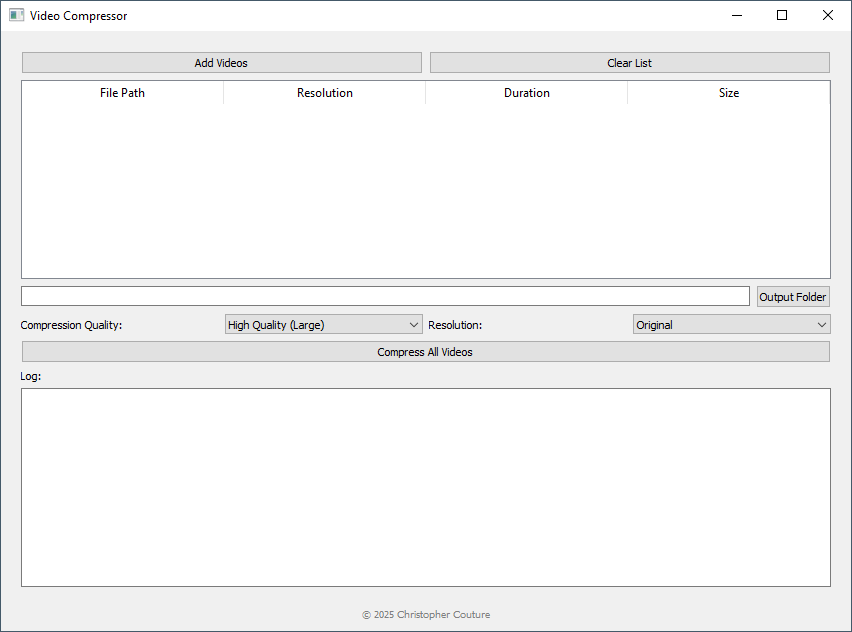

# 🎞️ Video Compressor GUI

A lightweight, user-friendly batch video compressor built with Python, PyQt5, and FFmpeg.  
Easily compress multiple videos with selectable quality and resolution — no terminal knowledge required.



---

## ✨ Features

- 📁 **Batch Processing** — Compress multiple videos at once.
- 🎛 **Compression Presets** — Easy-to-understand quality dropdown (e.g., High Quality, Low Quality).
- 📐 **Resolution Selection** — Downscale to 1080p, 720p, 480p, or keep original resolution.
- 📊 **Metadata Preview** — View resolution, duration, and file size before compressing.
- 🪄 **Built-in FFmpeg + FFprobe** — No need to install separately.
- 🖱 **Drag-and-drop–free simplicity** — Just click and compress.
- 🧾 **Persistent Settings** — Remembers last used options.
- 🖥 **Windows .exe** build with PyInstaller included.
- © **Footer Branding** — Your name, your work.

---

## 📦 Installation

### 🔧 Requirements (for development)

- Python 3.10+
- [FFmpeg Static Binaries](https://www.gyan.dev/ffmpeg/builds/) (`ffmpeg.exe` & `ffprobe.exe` must be in the same folder)
- pip packages:
  ```bash
  pip install pyqt5 pyinstaller
  ```

---

## 🚀 Usage

### 💻 Run from source:

```bash
python video_compressor_gui_ffprobe_footer.py
```

### 🛠 Build the executable:

Use the included `build.bat` script (Windows only):

```bash
./build.bat
```

Output will appear in the `dist/` folder as `video_compressor_gui.exe`.

---

## 📸 Screenshot

> *(Add a real screenshot here)*

---

## 📂 Project Structure

```
video-compressor/
├── video_compressor_gui_ffprobe_footer.py
├── ffmpeg.exe
├── ffprobe.exe
├── build.bat
├── video_compressor_gui_ffprobe.spec
├── dist/
└── README.md
```

---

## 🔒 License

This project is licensed under the MIT License.

---

## 👨‍💻 Author

**Christopher Couture**  
© 2025 Christopher Couture  
